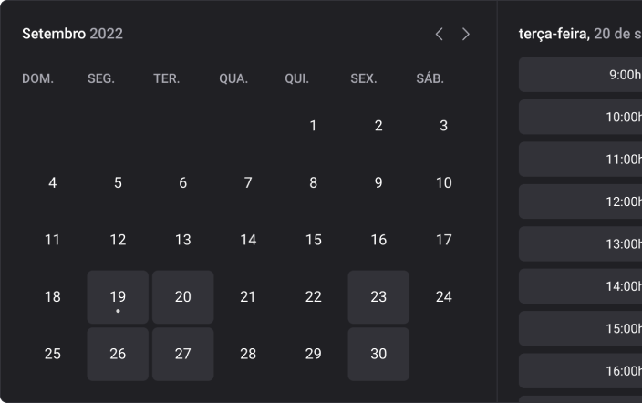
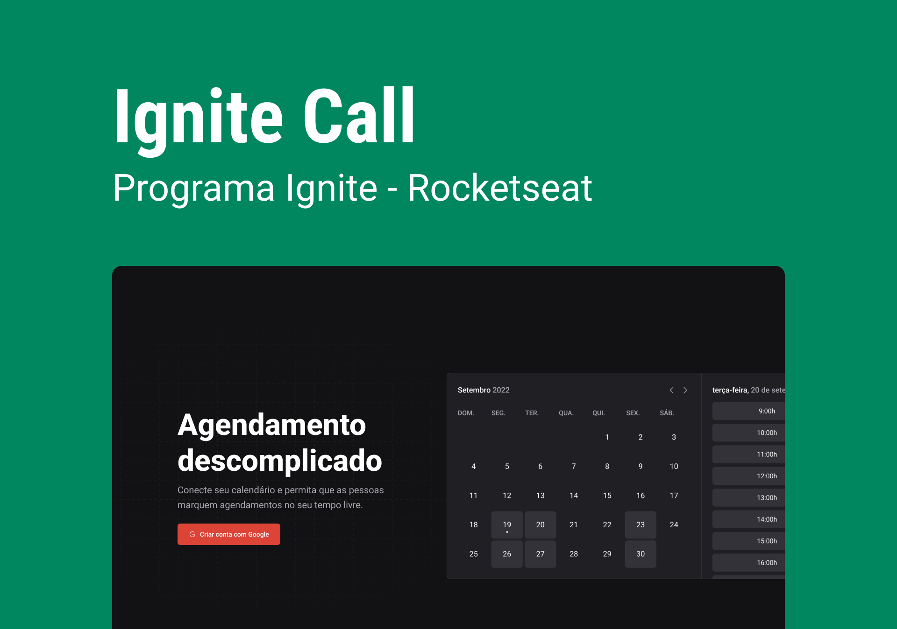

<h1 align="center" style="display: flex; align-items: center; width: 100%; justify-content: center; gap: 1rem;" >
    
    <div>Ignite Call</div>
</h1>

<p align="center" style="text-align: justify">
O Ignite Call é uma aplicação de agendamento de chamadas. Este projeto serviu de base para reforçar os conhecimentos no framework NextJs, junto ao conceitos de API Routes, páginas SSG e SSR. Além disso, a aplicação possui conectividade com o GoogleAPIs, podendo marcar agendamentos no Google Calendar, além de gerar salas no Google Meet para as reuniões automaticamente.<br/>
</p>

<p align="center">
  <a href="#-tecnologias">Tecnologias</a>&nbsp;&nbsp;&nbsp;|&nbsp;&nbsp;&nbsp;
  <a href="#-projeto">Projeto</a>&nbsp;&nbsp;&nbsp;|&nbsp;&nbsp;&nbsp;
  <a href="#-layout">Layout</a>&nbsp;&nbsp;&nbsp;|&nbsp;&nbsp;&nbsp;
  <a href="#memo-licença">Licença</a>
</p>

<p align="center">
  
</p>

<br>

<p align="center">
  
</p>

## 🚀 Tecnologias

Esse projeto foi desenvolvido com as seguintes tecnologias:

- HTML, CSS e JavaScript
- Git e Github
- Figma
- Biblotecas:
    - [@hookform/resolvers](https://github.com/react-hook-form/resolvers)
    - [@ignite-ui/react](https://www.npmjs.com/package/@ignite-ui/react)
    - [react-query](https://tanstack.com/query/v3/)
    - [axios](https://axios-http.com/ptbr/)
    - [dayjs](https://day.js.org/)
    - [eslint](https://eslint.org/)
    - [googleapis](https://developers.google.com/apis-explorer)
    - [next](https://nextjs.org/)
    - [next-auth](https://next-auth.js.org/)
    - [next-seo](https://github.com/garmeeh/next-seo)
    - [nookies](https://github.com/maticzav/nookies)
    - [phosphor-react](https://phosphoricons.com/)
    - [prisma](https://www.prisma.io/)
    - [react](https://pt-br.reactjs.org/)
    - [react-hook-form](https://react-hook-form.com/)
    - [typescript](https://www.typescriptlang.org/)
    - [zod](https://github.com/colinhacks/zod)

## 💻 Projeto

O Ignite Call é um projeto que foi moldado visualmente utilizando um design system, você mesmo pode vê-lo e testa-lo bem [aqui 👋](https://pedrohenrikle.github.io/design-system/). Caso deseje vistar meu repositório do projeto anterior, ele está bem [aqui 👋](https://github.com/pedrohenrikle/design-system). Esta foi minha primeira aplicação fullstack, onde pude aprender tanto desenvolvimento back-end com banco de dados, quanto aprimorar meu repertório no front-end e, além disso, aprender a comunicação entre ambos que é ```essencial```.

- [Visite o projeto online](https://ignite-call-pink-two.vercel.app/)

## 🔖 Layout

Você pode visualizar o layout do projeto através [deste link 👋](https://www.figma.com/file/WQmyowq4Scf3nmwmVJmuEf/Ignite-Call-(Community)?type=design&node-id=0-1&t=Q2IhstZIUPwxknib-0). É necessário ter conta no [Figma](https://figma.com) para acessá-lo.

## :memo: Licença

Esse projeto está sob a licença MIT.

---

## ✍ Author
<br>


<p>
    Made with 💜 by Pedro Henrique Klein
</p>
<p align="left">
    <a href="https://www.linkedin.com/in/pedro-klein/" target="_blank">
        
    </a>
    <a href="mailto:pedro.klein.sl@gmail.com" target="_blank">
        
    </a>
</p>